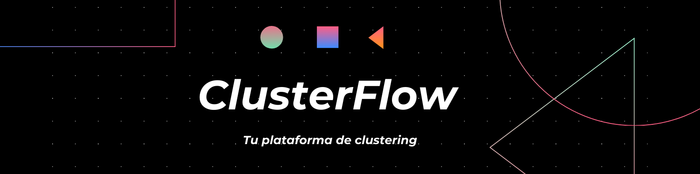

# ClusterFlow - Automatic Clustering Application

## 📖 Project Description

**ClusterFlow** is an intelligent web platform for clustering analysis that automates the entire machine learning pipeline for data segmentation. Designed for data scientists, analysts, and ML professionals, this application offers a complete flow from data loading to results export, all through an intuitive visual interface.

### What does ClusterFlow do?

ClusterFlow simplifies the clustering analysis process through:

- **Automated pipeline**: Step-by-step guide from raw data to final clusters
- **Intelligent variable selection**: Automatic algorithm that identifies optimal features
- **Multiple clustering algorithms**: K-Means, DBSCAN, and Agglomerative with automatic best selection
- **Complete exploratory analysis**: Statistics, distributions, outliers, and correlations with improved visualizations
- **Automatic optimization**: Determination of optimal number of clusters using 4 different metrics
- **PCA visualization**: Automatic high-dimensional to 2D projection to visualize clusters
- **Professional export**: Download of labeled data, cluster profiles, and quality metrics

### Who is ClusterFlow for?

- Business analysts who need to segment customers or products
- Data scientists looking to automate repetitive clustering tasks
- Researchers requiring fast visual exploratory analysis
- Teams needing a collaborative and reproducible tool

---

## 🚀 Quick Start

### Option 1: Execution Script (Recommended - Windows)
```bash
# Easiest method: Double-click on run.bat
# Or from terminal:
.\run.bat
```

### Option 2: Command Line
```bash
# Run application
streamlit run app/main.py

# The application will open at http://localhost:8501
```

### Option 3: With Docker
```bash
# Build and run
docker-compose up --build

# Access the application
# http://localhost:8501
```

## 🔧 Usage

### 1. Load Data
Upload a CSV file with your data

### 2. Cleaning
Configure and execute cleaning:
- Remove duplicates
- Impute null values
- Remove outliers

### 3. Exploratory Analysis
- Descriptive statistics
- Distributions
- Outlier detection
- Correlations
- Bivariate analysis

### 4. Feature Engineering
- Variable selection
- New feature creation
- Multicollinearity analysis

### 5. Scaling
Choose scaling method:
- StandardScaler (Z-score)
- MinMaxScaler (0-1)
- RobustScaler (outlier-resistant)

### 6. Clustering
- Automatic optimal K determination
- Multiple algorithms (KMeans, Hierarchical)
- Automatic comparison

### 7. Results
- Cluster visualization
- Cluster profiles
- Results export

## 🎯 Features

✅ **Modularized**: Code organized in specialized modules  
✅ **Complete modular architecture**: 7 independent pages  
✅ **Centralized configuration**: Easy maintenance  
✅ **Complete analysis**: Exhaustive EDA  
✅ **Multiple algorithms**: KMeans, Hierarchical (Ward, Complete, Average)  
✅ **Advanced metrics**: Silhouette, Davies-Bouldin, Calinski-Harabasz  
✅ **Feature Engineering**: Variable creation and selection  
✅ **Visualizations**: Interactive and informative charts  
✅ **Export**: Download results in CSV  
✅ **Docker**: Containerized deployment  
✅ **Tests**: 75 tests with 99.2% coverage

## 🏗️ Architecture

ClusterFlow implements a **3-layer modular architecture** designed for scalability and maintainability:


### Architecture Layers

**1. Presentation Layer** (`pages/`)
- 7 independent modules with Streamlit interface
- State management with `st.session_state`
- Flow validation between pages

**2. Business Logic Layer** (`core/`)
- ML algorithms: clustering, scaling, cleaning
- Intelligent feature selection
- Automatic hyperparameter optimization

**3. Configuration Layer** (`config/`, `utils/`, `styles/`)
- Centralized and reusable configuration
- Independent auxiliary functions
- Consistent visual styles

### Data Flow

```
CSV → Load → Clean → EDA → Feature Eng. → Scale → Clustering → Results
      ↓      ↓       ↓         ↓            ↓         ↓           ↓
   Validate Impute Visualize Selection  Normalize Optimize  PCA + Export
            Outliers         Intelligent           Optimal K
```

### Key Technologies

- **Framework**: Streamlit 
- **ML**: scikit-learn (clustering, PCA, metrics)
- **Analysis**: pandas, numpy
- **Visualization**: matplotlib, seaborn
- **Testing**: pytest 
- **Containerization**: Docker + Docker Compose

---

## 🤝 How to Collaborate

Contributions are welcome! Here's how you can collaborate with ClusterFlow:

### Ways to Contribute

1. **Report Bugs** 🐛
   - Use the issue format to describe the problem
   - Include steps to reproduce the error
   - Attach screenshots if possible

2. **Propose New Features** 💡
   - Open an issue explaining the functionality
   - Describe use cases and benefits
   - Wait for feedback before implementing

3. **Improve Documentation** 📝
   - Fix errors or improve clarity
   - Add usage examples
   - Translate content to other languages

4. **Contribute Code** 💻
   - Fork the repository
   - Create a branch for your feature: `git checkout -b feature/new-feature`
   - Follow project code conventions
   - Add tests for your code (we maintain >99% coverage)
   - Run `pytest` to verify all tests pass
   - Commit with descriptive messages
   - Open a Pull Request explaining the changes


---

## 📄 License

This project is licensed under the **MIT License** - see the [LICENSE](LICENSE) file for details.

---

